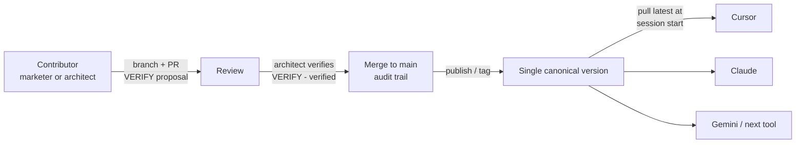

# Scaling the Skill via a Repo (Proposed)

> Written around **git** as the concrete implementation, but the model is just "a version-controlled
> repo as the single source of truth" — any equivalent version-control host works.

> **Status: PROPOSED for operational rollout — for this POC, a local copy is acceptable.**
>
> This is an architecture proposal for how *one* person's update to the governed skill or semantic
> layer reaches *every* user, while keeping the whole thing **tool-agnostic** (works today with
> Cursor and Claude, and with Gemini or whatever comes next).
>
> **Decision (2026-07-22):** For the POC itself, running from a **local copy** of these files is fine
> — the team is small and short-lived, and a local copy is enough to prove the end-to-end workflow.
> The recommendation for **the customer's operational rollout** is to host the governed skill + semantic
> layer in **their own git** and adopt the flow below, so updates propagate without drift. Owner
> sign-off required before the git model becomes the standing process.

Related: [skill/d360-segments-activations/SKILL.md](skill/d360-segments-activations/SKILL.md) ·
[reference/dataModel-dev.yaml](reference/dataModel-dev.yaml) ·
[reference/before-using-and-on-data-model-changes.md](reference/before-using-and-on-data-model-changes.md) ·
[setup/03-connect-claude.md](setup/03-connect-claude.md)

---

## The problem

The governance surface — `SKILL.md`, the semantic layer (`dataModel-dev.yaml`), the segment/validation
references — is just **text**. Today it's *copied* onto each user's machine (see
[setup/03](setup/03-connect-claude.md#install-the-governed-skill), "copy … into your skills
directory"). A copied file has an **N-copy problem**: the moment the architect verifies a field or
fixes a join, every other copy is stale until each person manually re-copies. Drift is the default
state, and drift in a governance artifact means users silently run different, unaudited rules.

Two requirements pull in different directions:

1. **One edit must benefit everyone** — propagation has to be reliable, not "remember to re-copy."
2. **It must stay tool-agnostic** — the contract can't depend on a Cursor-only or Claude-only
   feature, because the client will change (Gemini, CLI agents, future tools) but the governed rules
   must not.

Git satisfies both **if** we treat these files as a *released product*, not a shared folder.

---

## Why git is the tool-agnostic answer

The artifacts are **vendor-neutral plain text** (Markdown + YAML). Nothing in them is specific to a
model or client — `SKILL.md` even refers to the server only by its logical name `data360`, never by
a URL or a machine path. That means the **contract is "these files, in this git repo, at this
version."** Any agent that can read files can consume it:

| Client | How it loads the same files (thin, swappable shim) |
|---|---|
| Cursor | project rules / skills pointing at the repo |
| Claude (Code/Desktop) | skills directory sourced from the repo |
| Gemini / future agent | system context / file load from the same repo checkout |

The **only** per-tool piece is that thin "load these files (and pull latest) at session start"
shim. The governed content underneath is identical for all of them. Git is the lowest common
denominator every current and future tool already speaks — so the semantic layer and skill outlive
any single vendor.

---

## The model: author in git, publish to one source, read at runtime

Treat `dataModel-dev.yaml` and the skill like code that gets **reviewed and released**, not a file that
gets hand-copied. Three roles, one flow:

1. **Author + review in git.** A contributor opens a PR (a marketer may *propose* a `VERIFY` entry;
   only the architect flips it to `verified`). The PR is the review gate and the audit trail — the
   same governance bar the runbook already sets for `SKILL.md` and `dataModel-dev.yaml`. This is exactly
   the loop already described in
   [before-using-and-on-data-model-changes.md](reference/before-using-and-on-data-model-changes.md);
   this doc just makes it the *distribution* mechanism too.
2. **Publish on merge.** Merging to `main` (optionally tagging a release) produces the single
   canonical version everyone reads. Nobody edits their own copy; they consume the released one.
3. **Read the latest at session start.** Each client pulls `main` (or a pinned tag) before it runs,
   so a merged change reaches every user on their next session — no manual re-copy.

The mental shift: **git is the front-end for humans (edit, review, approve); the released checkout
is the back-end for agents (read at runtime).** One person's edit benefits everyone because agents
don't read the file *you* edited — they read the *released* copy your merge produced.

---

## What's shared vs. what stays local

Keeping this boundary crisp is what lets one repo serve everyone without leaking machine specifics.

| Shared (lives in the repo, one canonical copy) | Local / per-user (never in the shared contract) |
|---|---|
| `SKILL.md` and the recipes/guardrails | MCP connection config (server URL, ECA `CLIENT_ID`) |
| `reference/dataModel-dev.yaml` (semantic layer) | Per-user OAuth tokens (PKCE login) |
| `reference/*.md`, `validation/*` | Secrets (`.env`) — already gitignored |
| The thin per-tool loader shim | Data 360 license + permission set (identity/access) |

Per-user identity staying local is a **feature**: it preserves native per-user FLS / sharing /
audit. Everyone reads the *same rules*; each person still authenticates as themselves.

---

## Propagation ladder (adopt incrementally)

All rungs are git-centric and tool-agnostic. Start cheap; harden as the user base grows.

| Rung | Mechanism | One edit reaches everyone… | Trade-off |
|---|---|---|---|
| 0 (today) | Manual copy / manual `git pull` | …only when each person remembers | Drift is the default |
| 1 | **Session-start `git pull`** on the repo checkout (a tiny shell step each tool runs before load) | …on their next session, automatically | Needs network + a clean checkout |
| 2 | **CI publish + release tags**; environments pin a version, bump deliberately | …when the pinned version is bumped | Adds a release step; intentional lag |
| 3 | **Served resource** — CI publishes the approved file to one read-at-runtime location we control (raw git URL / object store, or an **MCP resource served by a server we run**) that each client fetches at session start | …instantly, no local copy at all | Must gate publish behind review; adds a network dependency (no offline) + access control on the endpoint |

Rung 1 is the recommended near-term step for the POC: it removes the "remember to re-copy" failure
mode with almost no infrastructure. Rung 3 (fetching the semantic layer from a single served
location so every client reads the same bytes with no local copy) is the end-state for many users.

> **Today, the D360 MCP server does not host the semantic layer.** Its metadata is only the
> *physical schema* — object and field API names, nothing more. `dataModel-dev.yaml` is a human-authored
> *semantic + governance* layer (verified joins, business context, `VERIFY→verified` state,
> guardrails) that has no representation inside D360 as it stands. So a Rung-3 "served resource"
> should be something **we** control — a raw repo URL, an object store, or a resource-serving MCP
> server we stand up — rather than the D360 data server.
>
> *Forward-looking (not currently supported):* hosting `SKILL.md`-style artifacts and richer
> metadata in D360 to support headless use cases is not available today. If that changes, the
> semantic layer could eventually "live next to the data." Treat it as a possible future, not
> something to design against today.

---

## Versioning, pinning, rollback

- **Version the contract.** Tag releases (e.g. `datamodel-v3`, or bump `version:` in
  `dataModel-dev.yaml`). An environment can pin a known-good version and upgrade on purpose rather than
  being surprised by `main`.
- **Audit is free.** `git log` / PR history answers "who changed this join, when, and who approved
  it" — the audit trail a governance artifact requires.
- **Rollback is `git revert`.** A bad merge is one commit to undo, and every client picks up the
  revert on its next pull — the same path as a normal update.

---

## Risks & mitigations

| Risk | Mitigation |
|---|---|
| A client never pulls → runs stale rules | Session-start pull (rung 1); optionally refuse to run if the checkout is older than N (report the version it loaded). |
| Un-reviewed edit reaches everyone (rung 3) | Publish only *after* merge/approval; the served copy is the *released* one, never a working branch. |
| YAML merge conflicts on `dataModel-dev.yaml` | One canonical file, small focused PRs, architect as owner; treat like any reviewed code change. |
| Offline / air-gapped clients | Git works offline against the last checkout; pin a version and sync when connectivity returns. |
| Tool-specific loader drift | Keep the shim thin and documented per tool; the governed content never depends on it. |

---

## Proposed next steps

**For this POC:** no action — a local copy of the skill + semantic layer is accepted (decision
above). Keep using the copy step in
[setup/03](setup/03-connect-claude.md#install-the-governed-skill).

**For the customer's operational rollout** (the recommendation — host it in their own git):

1. Make the **git repo the single source of truth** for the whole skill (not just `dataModel-dev.yaml`),
   and stop hand-copying it (supersede the copy step in
   [setup/03](setup/03-connect-claude.md#install-the-governed-skill)).
2. Adopt **rung 1**: a session-start `git pull` shim, documented once per tool (Cursor, Claude,
   Gemini), so a merged change auto-reaches every user next session.
3. Keep the **author → PR → architect-verify → merge** loop as the *only* way the contract changes
   (already the governance model in
   [before-using-and-on-data-model-changes.md](reference/before-using-and-on-data-model-changes.md)).
4. When the user base grows, evaluate **rung 3** — serving `dataModel-dev.yaml` from a single location we
   control (a pinned raw URL, an object store, or a resource-serving MCP server we run) so there are
   zero local copies to drift. Today this shouldn't be the D360 MCP server — it exposes only the
   physical schema, not our semantic layer. Hosting skills/metadata in D360 for headless use cases is
   not currently supported, but that could change in the future.
